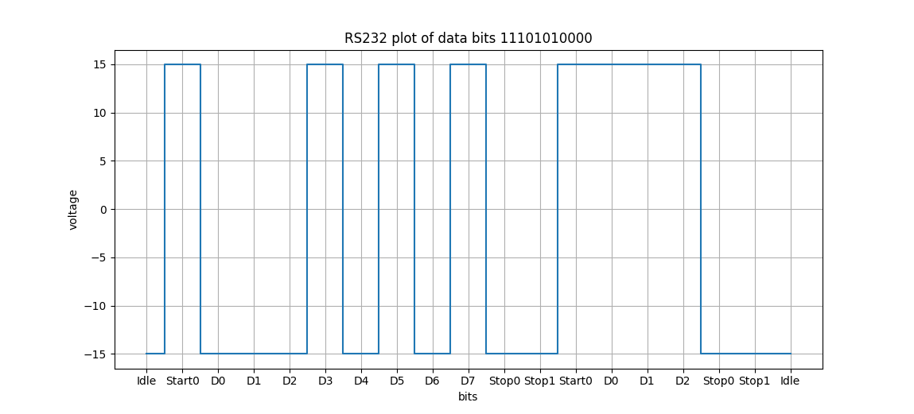

# RS232-Waveform-Plotter
### Generate plots of RS232 waveforms, labelling bits along the x axis. 

#### Usage
- usage: rs232-plotter.py [-h]
    parity voltage data numstartbits numstopbits numdatabits

- positional arguments:
    - parity : Set parity bit calculation to even, odd or none.
    - voltage : max/min voltage to plot, eg 15 would plot for +15V to -15V.
    - data : String of data bits to plot, all bits must be sequential in a string.
    - numstartbits : per sequence, the number of bits to include & mark as start bits.
    - numstopbits : per sequence, the number of bits to include & mark as stop bits.
    - numdatabits : per sequence, the number of data bits to include before calculating parity and initiating new sequence.

#### Requirements
```matplotlib```

#### Example output
The following graph was generated with this command: 
```python3 rs232-plotter.py none 15 11101010000 1 2 8```
